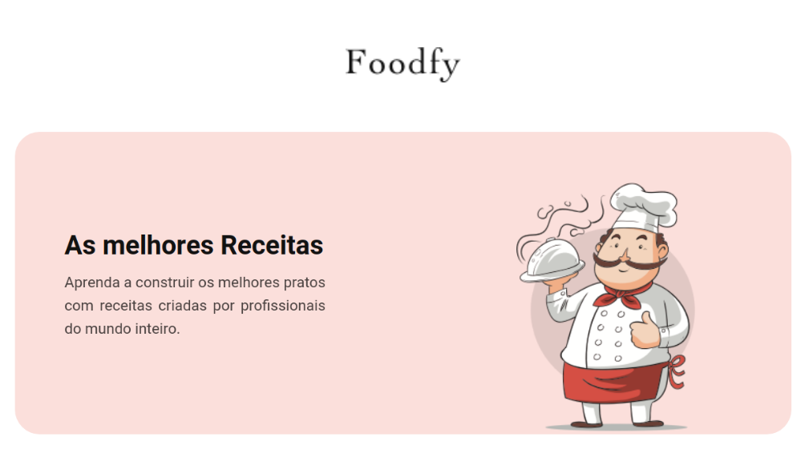
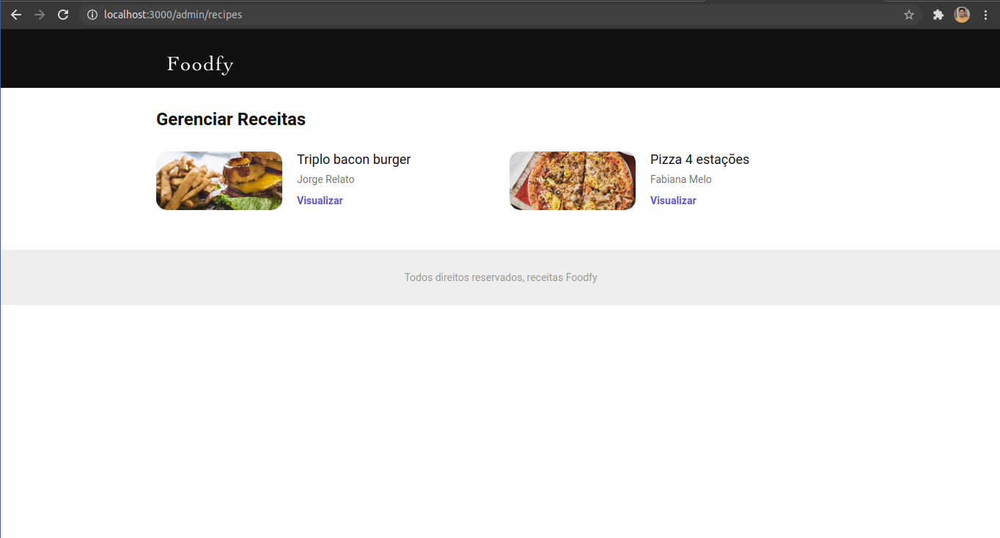
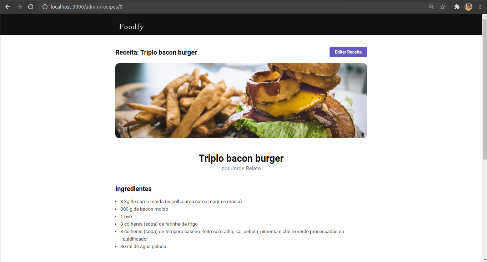
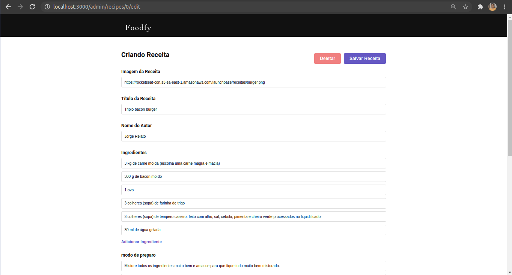
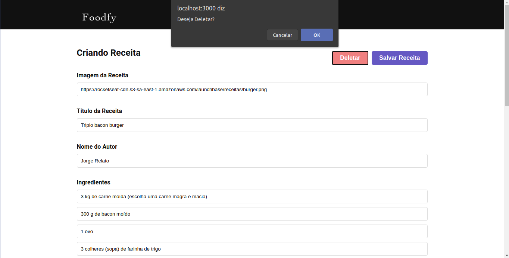
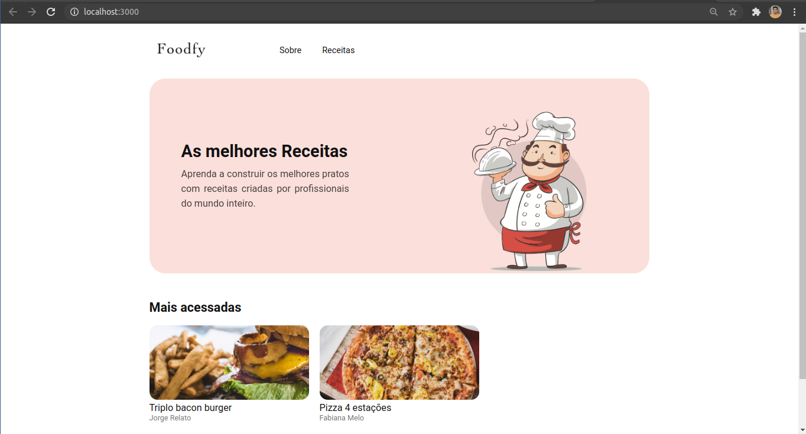
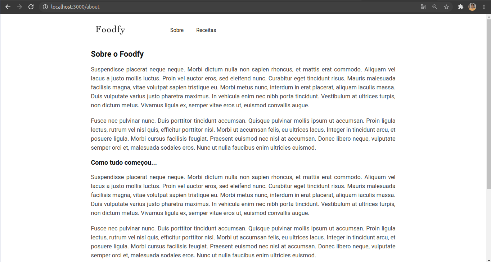
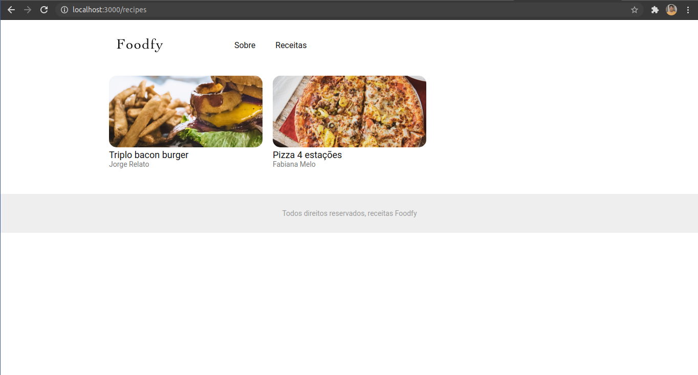

<h1 align="center">
     
</h1>
 
<h4 align="center"> 
	🚀 Desafio Principal - Foodfy version 3 🚀
</h4>

<p align="center">
  

  

  	
  <a href="https://www.linkedin.com/in/paulobeckman/">
    
  </a>
	
  
  <a href="https://github.com/paulobeckman/Foodfy-v3/commits/master">
    
  </a>

  
   <a href="https://github.com/paulobeckman/Foodfy-v3/stargazers">
    
  </a>
</p>


## 💻 Sobre o projeto

🍛 Foodfy é um site que nesse projeto está na versão 3. Nesse site o chefe pode cadastrar, editar, visualizar e deletar a sua receita pela pagina admin. Essa receita cadastrada também será visualizada na página de receitas onde todos todos podem somente visualizar.

- Os items que podem ser cadastrados são: 
  - Uma url da imagem da receita;
  - O título da receita;
  - O autor da receita; 
  - Ingredientes;
  - Modo de preparo;
  - Mais informações.

Na aba receitas apresenta vários cards de receitas que ao serem clicados, o usuário irá ser direcionado para uma página onde encontrado mais detalhes daquela receita como o Ingredientes, Modo de preparo e Informações adicionais, cada tópico desse conta com um botão que permite o usuário esconter ou mostrar o conteudo do tópico.


Projeto desenvolvido como desafio no curso **LaunchBase** oferecida pela [Rocketseat](rs).

"O [LaunchBase](lb) é um treinamento no formato de bootcamp online que tem duração de 8 semanas. A cada semana os conteúdos são liberados de acordo com um cronograma, guiando o aluno pelas ferramentas e conceitos mais modernos de desenvolvimento que permitirão construir as melhores aplicações e ter acesso às melhores oportunidades como programador." - Rocketseat


### Web

<p align="center" style="display: flex; align-items: flex-start; justify-content: center;">
	
  

  

  
  
  
  
  

  

  
  
  

</p>

## 🛠 Tecnologias

As seguintes ferramentas foram usadas na construção do projeto:

- [Node.js][nodejs]
- [Java Script][js]
- [CSS][CSS]
- [HTML][HTML]
- [Nunjucks][Nunjucks]
- [Unsplash Source][API]


## 🚀 Como rodar este projeto

Podemos considerar este projeto como sendo divido em duas partes:
1. Back End (arquivos server.js, data.json, routes.js e pasta public o arquivo script.js) 
2. Front End (pasta views, pasta public o arquivo styles.css)

💡Ao iniciar tanto o front end quanto o back end iniciarão automaticamente. 

### Pré-requisitos

Antes de começar, você vai precisar ter instalado em sua máquina as seguintes ferramentas:
[Git](https://git-scm.com), [Node.js][nodejs]. 
Além disto é bom ter um editor para trabalhar com o código como [VSCode][vscode]

### 🧭 Rodando a aplicação web (Front End e Back End)

```bash
# Clone este repositório
$ git clone https://github.com/paulobeckman/Foodfy-v3.git

# Acesse a pasta do projeto no terminal/cmd
$ cd Foodfy-v3

# Instale as dependências
$ npm install

# Execute a aplicação em modo de desenvolvimento
$ npm start

# O servidor inciará na porta:3000 - acesse http://localhost:3000
```


## 📝 Licença

Este projeto esta sobe a licença MIT. Veja a [LICENÇA](license) para saber mais.

Feito por Paulo Beckman 👋🏽 [Entre em contato!](https://www.linkedin.com/in/paulobeckman/)

[nodejs]: https://nodejs.org/
[vscode]: https://code.visualstudio.com/
[license]: https://opensource.org/licenses/MIT
[rs]: https://rocketseat.com.br
[lb]: https://pages.rocketseat.com.br/launchbase/inscricao/5
[js]: https://developer.mozilla.org/pt-BR/docs/Aprender/JavaScript
[CSS]: https://developer.mozilla.org/pt-BR/docs/Web/CSS
[HTML]: https://developer.mozilla.org/pt-BR/docs/Web/HTML
[Nunjucks]: https://www.npmjs.com/package/nunjucks
[API]: https://source.unsplash.com/
